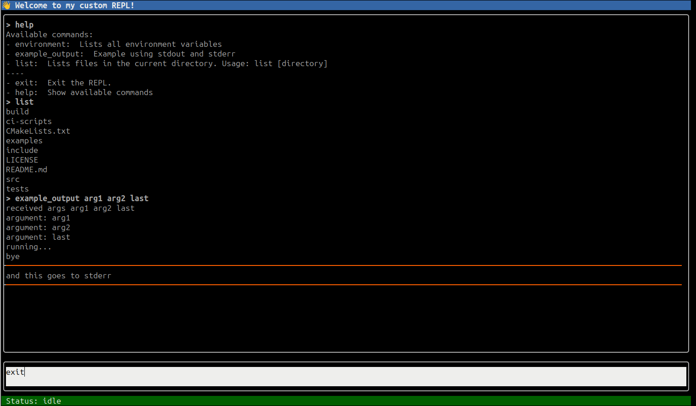

# REPLmk

Friendly custom REPL building tool

!! Beta version !!



## Features

- Custom commands definitions via configuration files
- Save and restore command and output history


## Usage

The simplest way to starting a REPL is just by, well, typing `replmk` in the terminal.

And to see what command line arguments are available, you can use the `--help` option:

```bash
replmk --help
```

The `-c, --config` argument is how you make the tool actually useful.

The config file is a yaml file where you define the commands you want to be available in your REPL, along side other specific options specific to your REPL usability requirements.

The config file has the following structure:

```yaml
prompt: ">" # Prompt character or text, displayed in the command input box
initial_message: "Welcome to replmk!" # A Welcome message shown when the REPL starts

input_note: "Type a command" # Message shown in the command input box
alt_help_cmd: "help" # Default command to show the help screen
alt_help_desc: "Show this screen:" # Description of the help command in the help screen
alt_exit_cmd: "exit" # Default command to exit the REPL
alt_exit_desc: "Exit the REPL." # Description of the exit command in the help screen

commands: # List of accepted commands
  - name: <command name> # Command name
    description: "<command description>" # Command description
    type: <command type> # Command type. It can be single or shell
    exec: <command execution> # What should be executed when the command is entered. For single commands, it is a string. For shell commands, it is a string that can span multiple lines.
```

An example config file can be found in [examples/simple.yaml](examples/simple.yaml).

You can also specify a file to save and load the command history as well as the output history. The arguments for that are:

```bash
-s, --command-history-file arg -> Optional path to a file where to save the command history
-o, --output-history-file arg -> Optional path to a file where to save the output history
```

If not specified, the default values for those arguments are:

- Command history file: `~/.replmk_history`
- Output history file: `~/.replmk_output_history`

## Installation from source

Requirements:
- CMake 3.27 or higher
- A modern, C++23 compiler
- Linux (sorry)

```bash
git clone https://github.com/bira/replmk.git

cmake -B build -DCMAKE_BUILD_TYPE=Release
make -C build
```

The binary will be in `build/src/replmk`

## Dependencies

Many thanks to the people who created the great libraries and tools in use by this project. Here is a list of them:

- [doctest](https://github.com/doctest/doctest)
- [yaml-cpp](https://github.com/jbeder/yaml-cpp.git)
- [cxxopts](https://github.com/jarro2783/cxxopts.git)
- [ftxui](https://github.com/ArthurSonzogni/FTXUI.git)
- and of course, [CMake](https://cmake.org/) and your favourite C++ Compiler